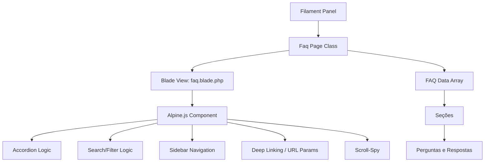

# Design Document: FAQ System

## Overview

A Página FAQ é uma página estática Filament que serve como documentação interna do sistema Mobilia Decor. Ela permite que qualquer usuário autenticado consulte rapidamente como cada funcionalidade do sistema opera, sem necessidade de armazenamento em banco de dados.

A arquitetura é intencionalmente simples: uma única página Filament com uma view Blade que utiliza Alpine.js (já incluído no Filament) para interatividade client-side (acordeão, busca com debounce, scroll-spy, deep linking). O conteúdo é definido como um array PHP estruturado diretamente na classe da página.

### Decisões de Design

1. **Conteúdo em código vs banco de dados**: O conteúdo é definido como array PHP na classe da página. Isso elimina a necessidade de migrations, seeders, e interface de administração. A manutenção é feita via código-fonte com versionamento Git.

2. **Alpine.js para interatividade**: O Filament 3.x já inclui Alpine.js. Toda a lógica de UI (acordeão, busca, scroll) é implementada com diretivas Alpine, evitando dependências adicionais de JavaScript.

3. **Busca client-side**: Como o conteúdo é estático e carregado integralmente na página, a busca é feita no browser via Alpine.js com debounce de 300ms. Não há necessidade de requisições ao servidor.

4. **Normalização de texto para busca**: A busca ignora acentos e maiúsculas/minúsculas usando `normalize('NFD')` + regex para remover diacríticos, garantindo que "entrega" encontre "Entrega" e "próximo" encontre "proximo".

## Architecture



### Fluxo de Dados

1. O usuário acessa `/admin/faq` (ou com parâmetro `?secao=slug`)
2. A classe `Faq` (Filament Page) carrega e passa o array de dados para a view
3. A view Blade renderiza o HTML com diretivas Alpine.js
4. Alpine.js inicializa o componente com:
   - Estado do acordeão (todas seções colapsadas por padrão)
   - Lógica de busca com debounce
   - Scroll-spy para destacar seção ativa no sidebar
   - Deep linking via URL params (leitura no `init()`)

## Components and Interfaces

### 1. Classe PHP: `App\Filament\Pages\Faq`

```php
<?php

namespace App\Filament\Pages;

use Filament\Pages\Page;

class Faq extends Page
{
    protected static ?string $navigationIcon = 'heroicon-o-question-mark-circle';
    protected static ?string $navigationGroup = 'Ajuda';
    protected static ?string $navigationLabel = 'FAQ';
    protected static ?string $title = 'FAQ - Perguntas Frequentes';
    protected static string $view = 'filament.pages.faq';
    protected static ?int $navigationSort = 99;

    public static function canAccess(): bool
    {
        return true; // Acessível a todos os usuários autenticados
    }

    public function getSections(): array
    {
        return $this->getFaqData();
    }

    private function getFaqData(): array
    {
        // Retorna array estruturado com todas as seções e perguntas
        return [
            [
                'slug' => 'dashboard-vendas',
                'title' => 'Dashboard Vendas',
                'icon' => 'heroicon-o-chart-bar',
                'questions' => [
                    [
                        'question' => '...',
                        'answer' => '...',
                        'destructive' => false,
                    ],
                    // ...
                ],
            ],
            // ... demais seções
        ];
    }
}
```

### 2. View Blade: `resources/views/filament/pages/faq.blade.php`

Estrutura principal da view com Alpine.js:

```html
<x-filament-panels::page>
    <div x-data="faqPage(@js($this->getSections()))" class="flex gap-6">
        <!-- Sidebar Navigation (sticky) -->
        <nav class="hidden lg:block w-64 shrink-0">
            <div class="sticky top-4 space-y-1 max-h-[calc(100vh-6rem)] overflow-y-auto">
                <!-- Links para cada seção -->
            </div>
        </nav>

        <!-- Main Content -->
        <div class="flex-1 space-y-6">
            <!-- Search Field -->
            <div class="...">
                <input type="text" x-model="searchQuery" @input.debounce.300ms="filterSections()" ... />
            </div>

            <!-- FAQ Sections (Accordion) -->
            <template x-for="section in filteredSections" :key="section.slug">
                <!-- Section accordion with questions -->
            </template>

            <!-- Empty State -->
            <div x-show="filteredSections.length === 0 && searchQuery.length >= 2">
                Nenhuma pergunta encontrada para o termo pesquisado
            </div>
        </div>
    </div>
</x-filament-panels::page>
```

### 3. Alpine.js Component: `faqPage`

```javascript
function faqPage(sections) {
    return {
        sections: sections,
        filteredSections: sections,
        searchQuery: '',
        expandedSections: {},
        expandedQuestions: {},
        activeSection: null,

        init() {
            this.handleDeepLink();
            this.initScrollSpy();
        },

        // Normaliza texto removendo acentos e convertendo para minúsculas
        normalizeText(text) {
            return text.normalize('NFD')
                .replace(/[\u0300-\u036f]/g, '')
                .toLowerCase();
        },

        // Filtra seções e perguntas com base no searchQuery
        filterSections() {
            if (this.searchQuery.length < 2) {
                this.filteredSections = this.sections;
                return;
            }
            const query = this.normalizeText(this.searchQuery);
            this.filteredSections = this.sections
                .map(section => ({
                    ...section,
                    questions: section.questions.filter(q =>
                        this.normalizeText(q.question).includes(query) ||
                        this.normalizeText(q.answer).includes(query)
                    )
                }))
                .filter(section => section.questions.length > 0);
        },

        // Lê parâmetro ?secao= da URL e navega até a seção
        handleDeepLink() {
            const params = new URLSearchParams(window.location.search);
            const secao = params.get('secao');
            if (secao) {
                const exists = this.sections.find(s => s.slug === secao);
                if (exists) {
                    this.expandedSections[secao] = true;
                    this.$nextTick(() => {
                        document.getElementById(`section-${secao}`)
                            ?.scrollIntoView({ behavior: 'smooth' });
                    });
                }
            }
        },

        // Observa scroll para destacar seção ativa no sidebar
        initScrollSpy() {
            // IntersectionObserver para detectar seção visível
        },
    };
}
```

### Interfaces

| Componente | Interface | Descrição |
|---|---|---|
| `Faq::getSections()` | `array` | Retorna array de seções com slug, title, icon, questions |
| `Faq::canAccess()` | `bool` | Sempre retorna `true` |
| `faqPage.filterSections()` | `void` | Filtra `filteredSections` baseado em `searchQuery` |
| `faqPage.normalizeText(text)` | `string` | Remove acentos e converte para minúsculas |
| `faqPage.handleDeepLink()` | `void` | Processa parâmetro URL e navega até seção |

## Data Models

Não há modelos de banco de dados para esta feature. O conteúdo é definido como array PHP estruturado.

### Estrutura do Array de Dados

```php
// Tipo: array<int, FaqSection>
[
    'slug' => string,        // Identificador URL-friendly (ex: 'dashboard-vendas')
    'title' => string,       // Título exibido (ex: 'Dashboard Vendas')
    'icon' => string,        // Heroicon identifier (ex: 'heroicon-o-chart-bar')
    'questions' => [         // array<int, FaqQuestion>
        [
            'question' => string,    // Texto da pergunta
            'answer' => string,      // Resposta em HTML (suporta negrito, listas, etc.)
            'destructive' => bool,   // Se a ação descrita é destrutiva/irreversível
        ],
    ],
]
```

### Regras de Validação do Conteúdo

- Cada seção DEVE ter um `slug` único e URL-safe (lowercase, hifens)
- Cada seção DEVE ter pelo menos 1 pergunta
- Respostas podem conter HTML seguro (tags: `<strong>`, `<ul>`, `<ol>`, `<li>`, `<br>`, `<code>`, `<p>`)
- Perguntas marcadas como `destructive: true` DEVEM conter aviso na resposta

## Correctness Properties

*A property is a characteristic or behavior that should hold true across all valid executions of a system — essentially, a formal statement about what the system should do. Properties serve as the bridge between human-readable specifications and machine-verifiable correctness guarantees.*

### Property 1: Section content completeness

*For any* FAQ section in the data array, it SHALL contain: a non-empty slug, a non-empty title, and at least 2 question-answer pairs where each question and answer are non-empty strings.

**Validates: Requirements 1.4, 6.5, 6.6**

### Property 2: Destructive action warnings

*For any* FAQ question marked as `destructive: true`, the answer text SHALL contain a warning indicator (the word "⚠️" or "aviso" or "irreversível" or "não pode ser desfeita").

**Validates: Requirements 2.5**

### Property 3: Search filter case and accent insensitivity

*For any* FAQ item whose question or answer contains a substring S, searching for any case variation or accent-stripped variation of S (with length >= 2) SHALL include that item in the filtered results.

**Validates: Requirements 3.2**

### Property 4: Short query returns all items

*For any* string of length 0 or 1 used as search query, the filter function SHALL return all FAQ sections with all their questions unchanged.

**Validates: Requirements 3.3**

### Property 5: Sections without matches are hidden

*For any* search query of length >= 2 that matches at least one question but not all sections, the filtered results SHALL contain only sections that have at least one matching question, and no section with zero matching questions SHALL appear.

**Validates: Requirements 3.6**

### Property 6: Valid URL slug deep linking

*For any* section slug that exists in the FAQ data, when the page is accessed with `?secao={slug}`, that section SHALL be in the expanded state.

**Validates: Requirements 4.3, 4.4**

### Property 7: Invalid URL slug fallback

*For any* string that does NOT match any existing section slug, when used as the `secao` URL parameter, all sections SHALL remain in the default collapsed state.

**Validates: Requirements 4.5**

### Property 8: Universal access for authenticated users

*For any* authenticated user regardless of their role (admin, financeiro, operacional, visualizador, marketing), the `canAccess()` method SHALL return `true`.

**Validates: Requirements 5.1**

## Error Handling

### Cenários de Erro

| Cenário | Comportamento |
|---|---|
| Parâmetro `?secao=` com slug inválido | Exibe página no estado padrão (todas seções colapsadas, topo) |
| Busca sem resultados | Exibe mensagem "Nenhuma pergunta encontrada para o termo pesquisado" |
| Busca com < 2 caracteres | Exibe todas as seções normalmente |
| JavaScript desabilitado | Conteúdo HTML é renderizado estaticamente (sem interatividade de busca/acordeão) |
| Usuário não autenticado acessa URL direta | Middleware do Filament redireciona para login |

### Graceful Degradation

- Se Alpine.js falhar ao carregar, o conteúdo HTML base permanece visível (todas as respostas ficam visíveis)
- A busca é uma funcionalidade de conveniência; sem ela, o usuário ainda pode navegar manualmente pelas seções
- O sidebar é ocultado em telas pequenas (< lg breakpoint) para não comprometer a leitura do conteúdo

## Testing Strategy

### Abordagem de Testes

Esta feature utiliza uma abordagem dual de testes:

1. **Testes unitários (PHPUnit)**: Verificam exemplos específicos, edge cases e configuração
2. **Testes baseados em propriedades (PHPUnit + geração de dados)**: Verificam propriedades universais da lógica de filtragem e estrutura de dados

### Testes Unitários (PHPUnit)

- **Acesso à página**: Verificar que usuários autenticados podem acessar, não-autenticados são redirecionados
- **Navegação**: Verificar label, grupo, ícone no menu
- **Estrutura do conteúdo**: Verificar que todas as seções obrigatórias existem
- **Conteúdo específico**: Verificar que seções detalhadas (Dashboard, Caixa, Integrações) contêm informações requeridas
- **Renderização**: Verificar que a view carrega sem erros

### Testes Baseados em Propriedades (PHPUnit)

Biblioteca: **PHPUnit** com data providers gerando inputs aleatórios (usando `Faker` já disponível no projeto).

Configuração: Mínimo 100 iterações por propriedade.

Cada teste de propriedade deve ser tagueado com comentário referenciando a propriedade do design:

```php
/**
 * Feature: faq-system, Property 3: Search filter case and accent insensitivity
 * For any FAQ item whose question or answer contains a substring S,
 * searching for any case variation or accent-stripped variation of S
 * SHALL include that item in the filtered results.
 */
```

#### Propriedades a Testar

| # | Propriedade | Estratégia |
|---|---|---|
| 1 | Section content completeness | Iterar sobre todas as seções e verificar campos obrigatórios |
| 2 | Destructive action warnings | Filtrar itens `destructive: true` e verificar presença de aviso |
| 3 | Search filter case/accent insensitivity | Gerar variações de case/acento de substrings existentes e verificar match |
| 4 | Short query returns all | Gerar strings de 0-1 caracteres e verificar retorno completo |
| 5 | Sections without matches hidden | Gerar queries que matcham parcialmente e verificar exclusão de seções vazias |
| 6 | Valid URL slug deep linking | Iterar sobre slugs válidos e verificar estado expandido |
| 7 | Invalid URL slug fallback | Gerar slugs aleatórios inválidos e verificar estado padrão |
| 8 | Universal access | Criar usuários com diferentes roles e verificar `canAccess()` |

### Testes de Integração

- Teste de renderização da página completa via Filament test helpers
- Teste de middleware de autenticação (redirect para login)

### Estrutura de Arquivos de Teste

```
tests/
├── Unit/
│   └── FaqPageTest.php          # Testes unitários da classe Faq
├── Feature/
│   └── FaqPageAccessTest.php    # Testes de acesso e renderização
```
